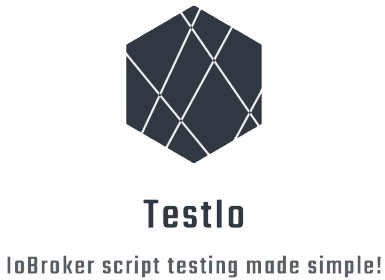

# TestIo - IoBroker JavaScript Test Framework




TestIo is small framework for testing [IoBroker JavaScript](https://github.com/ioBroker/ioBroker.javascript) scripts. It mocks the functions defined by the [JavaScript engine](https://github.com/ioBroker/ioBroker.javascript/blob/master/docs/en/javascript.md) with [Sinon.js](https://sinonjs.org/).

## Usage

TestIo can be used with any JavaScript test execution framework. This example uses [Mocha](https://mochajs.org/):

```javascript
describe("Switch tests", () => {

    // This test checks if Shelly_2 is switched on, when Shelly_1 is switched on.
    it("switches both shellies on", () => {

        // The check function loads the IoBroker script for the test and unloads it again after the test
        check("../../path/to/iobroker/script", () => {

            // simulate that Shelly_1 is switched on
            jsMock.on.trigger("shelly.0.Shelly_1.Relay0.Switch", { 
                state: { 
                    ack: true,
                    val: true
                }
            });

            // check if Shelly_2 is also switched on
            expect(jsMock.setState.fake.calledWith("shelly.0.Shelly_2.Relay0.Switch", true)).to.be.true;
        });
    });
});
```